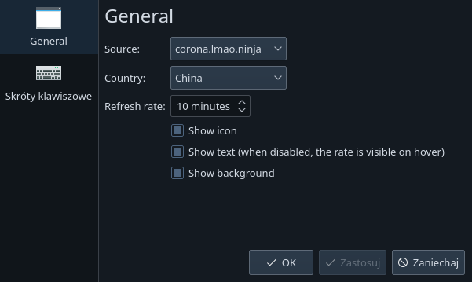

# COVID-19 Cases Plasmoid

## About
Plasma applet showing the current COVID-19 Cases by chosen country.

## Installation
```
plasmapkg2 -i package
```

Use additional `-g` flag to install plasmoid globally, for all users.

## Screenshots


)



## Changelog

### 1.0.2
Displays now global cases by default
New svg icon

### 1.0.1
Added support for coronavirusapi.me

### 1.0
Initial release
